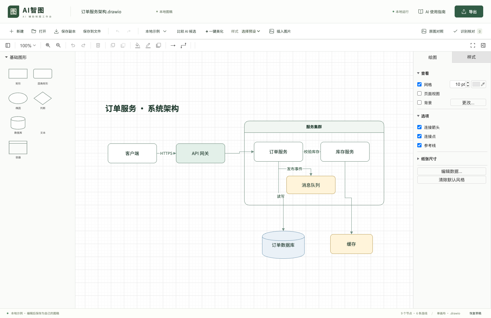
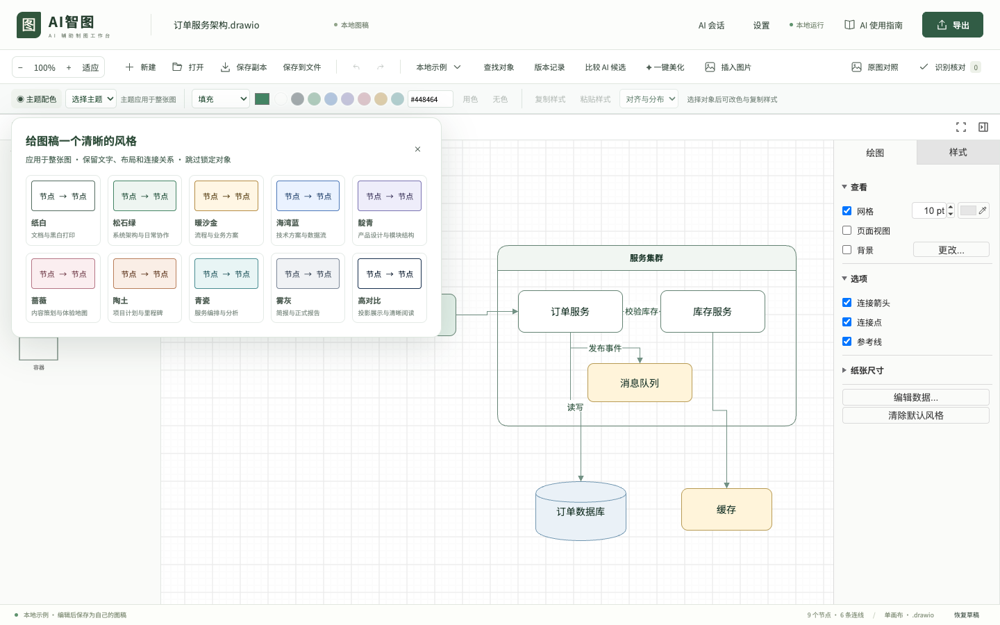

# AI智图 · AI ZhiTu

**本地与局域网共享绘图工作台 · v1.6.0**

在本地画布中调用你已有的 Codex/Qoder CLI，把文字或截图生成可编辑的 `.drawio` 文件，预览修改、自由编辑和导出。也可继续使用外部 Skill 生成文件。

AI智图基于 [draw.io](https://github.com/jgraph/drawio) 内核，提供本地工作台、`diagram-drawing` Skill、文件校验和渲染 CLI。适合需要把截图重画成可维护图稿的开发者、技术写作者和方案设计人员。

> AI 通过 Codex、Qoder 等外部客户端使用。工作台不内置模型，不提供 AI 账号、API 或额度。安装完成后的编辑、校验和导出在本机执行；外部 AI 的联网和数据处理由所用客户端决定。





## 为什么使用 AI智图

- **图稿可继续编辑**：文字、节点、连接线和分组都是独立对象，源文件使用 `.drawio`。
- **生成与修改衔接**：从截图生成、忠实还原、重新排版，到保存后再次交给 AI 改稿。
- **主题与快捷样式**：10 套主题、填充/边框/文字自定义颜色、最近 10 色、样式复制与对齐分布。
- **候选看得清、留得住**：独立大图预览、失败重试、候选源文件下载；编辑后撤销回原稿可继续应用，真实冲突仍受保护。
- **关键状态可找回**：对象查找、本地版本记录、AI 应用前备份，以及网页刷新后的任务接回。
- **结果可以核对**：原图并排查看、识别疑点定位，以及本地文件校验和预览。
- **本地编辑与导出**：无需绘图服务订阅，支持 PNG、SVG 和单页 PDF；字体与编辑器资源随仓库提供。
- **复用已有 AI 工具**：Skill 约束输出格式，CLI 提供确定性的校验和渲染；AI 客户端费用另计。

## 快速开始

### 环境要求

- Node.js **22.22 或更高版本**，推荐 **Node.js 24 LTS**，仓库 `.nvmrc` 指定 24。
- npm（随 Node.js 安装）。
- 推荐桌面版 Chrome / Edge。现有安装与浏览器测试主要在 macOS 完成，Windows / Linux 安装链路尚未完整验证。
- 首次安装需要联网下载 npm 依赖和 Playwright Chromium。

### 获取和启动

分享包解压后，运行 `node bin/zhitu.mjs` 即可初始化并启动；Mac 可双击 `start.command`。首次需要联网安装依赖，要求本机已安装 Node.js 22.22+。生成分享包用 `npm run package:local`，详见 [分享说明](docs/LOCAL_AI.md)。

在本仓库 GitHub 页面选择 **Code → Download ZIP** 并解压，或复制 **Code** 中的 Git 地址克隆仓库。打开终端，进入包含 `package.json` 的项目根目录，然后执行：

```sh
npm ci
npm run setup
npm run build
npm start
```

打开 **<http://127.0.0.1:4317>**。终端需保持运行，按 `Ctrl+C` 停止。

`setup` 会校验固定版本的 draw.io 资源、安装 Chromium 并运行工具自检。首次安装后，通常只需执行 `npm start`。macOS 也可双击 `start.command` 启动。

端口占用时：

```sh
npm start -- --port 4318
```

### 局域网共享工作区

主页为文件库，新建空白稿或选择模板后，首次修改内容或名称才自动保存到“全部文件”；未修改直接返回不留下文件。也可主动保存未修改图稿，导入文件直接入库。已保存的图稿默认仅创建者与本机管理员可见。点击分享图标，选择“仅自己 / 指定成员 / 所有成员”并保存权限后才会开放访问。支持创建人显示、我拥有的筛选、图稿名称编辑、批量移入回收站和恢复。每份图稿有独立地址，支持固定账号密码、记住登录、独占编辑锁、多人协同编辑、自动保存、其他页面自动更新和服务器版本。

```sh
node bin/zhitu.mjs --lan-host 192.168.1.10 --port 4317 --editor-port 4318
```

将地址替换为服务电脑的内网 IP。允许两个端口访问，成员使用固定账号和密码，可记住登录 30 天；旧浏览器在原身份上补设账号，无需工作区访问码。服务电脑使用 `http://127.0.0.1:4317/` 进入管理界面。数据默认保存在服务器 `~/.ai-zhitu/workspace.sqlite`。AI 使用服务器管理员配置的客户端和额度。详见 **[局域网部署、共享操作与备份](docs/LAN_WORKSPACE.md)**。

### 多人同时编辑

分享授权后，每位成员打开同一图稿，点击 **加入多人协同**。不同节点或不同属性的修改自动合并；节点文字按完整属性处理，同一属性以后提交到服务器的值为准。支持在线成员、自动重连和本人的撤销/重做。恢复历史或删除文件前，请所有人先退出协同。离线时保留页面或下载副本。详见 [多人协同技术方案](docs/design/COLLABORATION.md) 与 [自测报告](docs/testing/COLLABORATION_REPORT.md)。

### 先用模板体验

1. 在文件库点击 **新建图稿**，选择空白画布或模板；本地临时画布也可通过 **新建** 选择模板。
2. 双击节点修改文字，拖动节点和连接线，调整样式。
3. 点击 **下载副本**，下载可继续编辑的 `.drawio` 文件。
4. 点击 **导出**，生成 PNG、SVG 或 PDF。

详细步骤、保存区别与故障排查见 **[使用指南](docs/USAGE.md)**。

## 使用 AI 生成图稿

推荐从页面 **设置 → AI 客户端** 检测本机 CLI，完成一次连接测试，再打开 **AI 会话**。支持当前图、选区改稿和重新生成；候选经校验、差异预览后手动应用，支持一步撤销和过期基线拦截。会话显示实时执行摘要与耗时，输入框底部选择 CLI / Qoder 模型，Codex 使用本机配置。详见 [本地 AI 配置、状态与分享](docs/LOCAL_AI.md)。

以下是兼容保留的外部 AI 文件交换方式：

先按 **[AI 客户端接入说明](packages/ai-support/INSTALL.md)** 安装或链接 `diagram-drawing` Skill，再将截图附到支持图片输入、文件读写和本地命令的 AI 客户端中：

> 使用 diagram-drawing Skill，把这张架构图按原布局转成可编辑的 .drawio 文件。保留文字、节点和连接方向，看不清的内容标记待核对。输出到当前项目的 output 目录，调用本地工具校验并渲染 PNG 预览，交付源文件、预览和核对说明。

拿到文件后，在工作台点击 **打开**，选择 `.drawio`；按需加载原图对照并完成核对。

需要再次修改时，先保存人工编辑后的最新 `.drawio`，连同修改要求一起交给 AI。**AI 不会自动看到浏览器中未保存的内容。**

## 命令行

在项目根目录执行：

```sh
# 检查 Node、编辑器资源、字体、Chromium 和本地端口能力
node bin/diagram.mjs doctor --json

# 校验示例文件
node bin/diagram.mjs validate --input fixtures/examples/flow.drawio --json

# 导出图片（output 目录会自动创建）
node bin/diagram.mjs render --input fixtures/examples/flow.drawio --format png --output output/flow.png --scale 2

# 导出 SVG / PDF
node bin/diagram.mjs render --input fixtures/examples/flow.drawio --format svg --output output/flow.svg
node bin/diagram.mjs render --input fixtures/examples/flow.drawio --format pdf --output output/flow.pdf
```

输出文件已存在时会拒绝覆盖，请换一个文件名。完整参数见 [CLI 使用说明](docs/USAGE.md#命令行参考)。

## 当前范围

稳定使用流程以 **单画布流程图和系统架构图、规定的基础图形与样式** 为主。导入会进行兼容性校验，不承诺任意 draw.io 文件、插件、图形库都能无损打开。

候选差异审阅、授权保存到文件、PNG/SVG 嵌入源文件、主题和快捷样式已纳入本版验收。具体使用方法与验证边界见 [使用指南](docs/USAGE.md) 和 [v1.1 测试报告](docs/testing/V1_1_REPORT.md)。

支持通过本机 CLI 的网页内 AI 对话；提供固定账号和局域网共享编辑；支持多人同时修改图中对象，暂不提供云同步、逐字符协同或 MCP 外部实时画布控制。它是需要 Node.js 本地服务的应用，**不能直接部署为 GitHub Pages 静态网站**。

AI 识别可能出错；现有合成样本结果不代表所有真实截图的识别率。保留原文件，并检查关键文字和连接关系。

## 开发与贡献

```sh
npm ci
npm run setup
npm run dev
```

`npm run dev` 启动本地服务和 Vite 开发模式，默认地址仍为 `http://127.0.0.1:4317`。

```sh
npm run build     # 类型检查与生产构建
npm test          # 单元与 CLI 测试
npm run check     # 构建、单元、浏览器、交互、能力及图片导出检查
```

贡献前阅读 [CONTRIBUTING.md](CONTRIBUTING.md)。真实 AI 基准会使用个人客户端账号、额度及本机权限，不包含在普通测试或自动 CI 中。

| 目录 | 用途 |
| --- | --- |
| `apps/workbench` | React 工作台 |
| `apps/local-server` | 本地服务与编辑器隔离服务 |
| `packages/editor-adapter` | draw.io 适配层 |
| `packages/document-core` | 文档格式、校验与限制 |
| `packages/document-tools` | 候选比较、嵌入源文件等辅助能力 |
| `packages/render-worker` | 本地 Chromium 渲染与导出 |
| `packages/ai-support` | AI Skill、格式参考和安装说明 |
| `vendor/drawio` | 固定版本的上游资源与原始许可 |
| `fixtures` / `tests` | 示例、合成基准和自动化检查 |

## 文档

- [局域网共享与数据备份](docs/LAN_WORKSPACE.md)
- [使用指南与故障排查](docs/USAGE.md)
- [AI 客户端接入](packages/ai-support/INSTALL.md)
- [贡献指南](CONTRIBUTING.md) · [安全说明](SECURITY.md)
- [技术与产品文档](docs/README.md) · [测试报告](docs/testing/V1_1_REPORT.md)
- [GitHub 发布指南](docs/RELEASING.md)

## 开源许可与致谢

本项目自有代码、文档、Skill 和原创示例采用 **[Apache License 2.0](LICENSE)**，署名见 [NOTICE](NOTICE)。允许在遵守许可证的条件下使用、修改和分发，包括商业用途；软件按原样提供，不附带质量或适用性保证。

第三方组件继续遵循各自许可，详见 **[第三方声明](THIRD_PARTY_NOTICES.md)**。特别是 draw.io 的代码许可与其图标、stencil、模板资源条款需要分别理解；本项目许可证不替第三方资源重新授权。

感谢 draw.io、React、Playwright、Fontsource / Noto 等上游项目。AI智图是独立项目，与 draw.io、OpenAI、Qoder 等产品或组织没有官方隶属或背书关系。本项目不因使用工具而主张用户图稿的著作权；输入素材、模型服务及第三方内容的权利仍由相应条款约束。

## 当前交付与验证

- [产品规格](docs/product/PRD.md) · [技术设计](docs/design/TECHNICAL_DESIGN.md) · [使用指南](docs/USAGE.md) · [更新记录](CHANGELOG.md)
- [v1.1 验收与功能覆盖](docs/testing/V1_1_REPORT.md)：运行 `npm run check` 覆盖编辑、导出、AI 会话、预览、冲突、备份、主题与颜色；真实模型另测。
- 分享包执行 `node scripts/verify-local-package.mjs` 做独立安装启动验证。当前本机验收为 macOS arm64；未将其他操作系统和远程 CI 配置描述为已验证。

当前支持单画布和局域网共享工作区：多人查看、独占编辑，以及主动加入的多人协同编辑。协同每秒同步，不同对象与属性自动合并，同一属性以后提交为准。多页、复杂 UML/BPMN、逐字符协同和公网部署不在本版范围。当前文件保存与权限实测见 [v1.6 验证报告](docs/testing/V1_6_AUTOSAVE_REPORT.md)，账号管理见 [v1.5 验证报告](docs/testing/V1_5_ACCOUNTS_REPORT.md)。

账号升级、找回密码、本机用户管理与 HTTPS 配置见 [账号指南](docs/ACCOUNTS.md)。现有用户在原浏览器补设账号，保留文件和分享权限。
