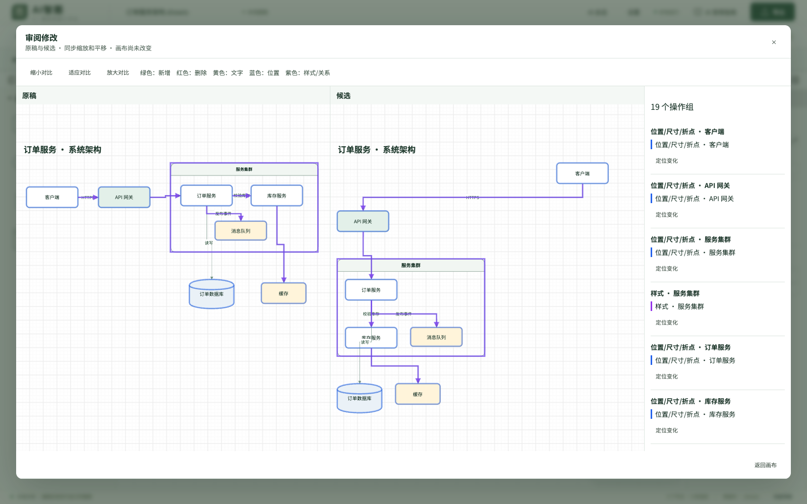
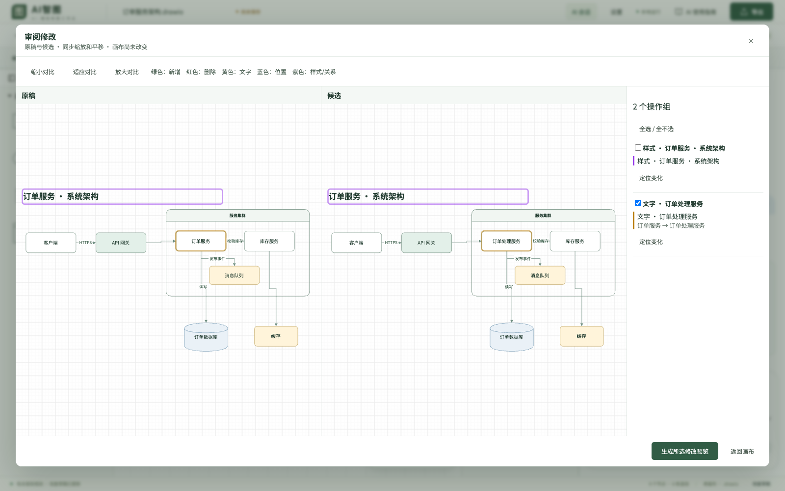

# P0 增强：自测与压力测试报告

日期：2026-09-22。范围为 [P0 产品规格](../product/P0_QUALITY_REVIEW_HISTORY.md) 中的三项功能。

## 交付与验证范围

- 智能排版与交付检查：整图/选区、标题保护、锁定对象及其子对象、循环流程、四类排版、候选预览、过期基线保护和一次撤销。
- 可视化改稿审阅：两个真实 draw.io 只读画布、同步缩放和平移、颜色及文字图例、定位、完整操作组选择、部分接受、并发冲突检测、重新预览门槛。
- 持久会话与候选：基线/请求/候选跨重启、运行任务中断标记、账号及文档隔离、撤权拦截、名称与应用状态、期限与容量清理；临时稿首次入库及晚完成任务的历史身份关联。

模型相关测试均使用模拟 CLI 和合成数据，没有调用真实模型，不代表识别准确率或真实模型响应速度。

## 实际命令

- `npm run build`：类型检查、生产构建通过。Vite 保留已有 `/fonts/fonts.css` 运行时解析提示，浏览器绘图与导出测试通过。
- `npm test`：全量单元/CLI 测试 105 项全部通过。
- `npm run test:e2e`：基础画布、编辑、文件往返、恢复、导出、离线资源检查通过。
- 以下命令顺序独立执行，全部退出码 0：

| 命令 | 实测耗时（秒） |
| --- | ---: |
| `npm run test:templates` | 15.9 |
| `npm run test:interactions` | 3.2 |
| `npm run test:capabilities` | 17.3 |
| `npm run test:images` | 2.3 |
| `npm run test:enhancements` | 2.1 |
| `npm run test:ai-chat` | 14.8 |
| `npm run test:product-audit` | 11.5 |
| `npm run test:product-polish` | 8.7 |
| `npm run test:shared` | 26.3 |
| `npm run test:share` | 2.7 |
| `npm run test:library` | 32.3 |
| `npm run test:library-pagination` | 4.0 |
| `npm run test:sharing` | 13.7 |
| `npm run test:accounts` | 30.2 |
| `npm run test:collaboration` | 79.1 |
| `npm run test:sharing-roles` | 20.7 |
| `npm run test:performance` | 19.5 |
| `npm run test:p0` | 6.7 |

- `node_modules/.bin/tsx tests/p0-stress.ts`：算法、HTTP、AI 队列和历史压力测试通过；也可使用 `npm run test:p0:stress` 复跑。
- `npm run docs:check`：本地 Markdown 链接检查通过。
- `git diff --check`：空白/冲突标记检查通过。

工作区原有未提交的弹窗改动另执行 `npm run test:dialogs` 通过（3.7 秒），该改动和脚本不纳入本次提交。

`npm run check` 初次执行在旧测试处中止；修复后完成了上表所列剩余全部检查，并重新执行全量单元测试。未将中止的总入口命令记作一次完整成功。

## 提交内容独立验证

从 Git 暂存区导出独立目录，排除工作区原有及其他任务的改动，使用 Node v22.22.0 再运行 `npm run build`、`npm run test:p0` 和 `npm run docs:check`，全部通过。P0 测试包含 9 项单元/API 测试及真实双画布浏览器流程。独立目录初次使用系统 Node 20 时不满足项目 `node:sqlite` 要求，切换到项目规定的 Node 22.22 后通过。

## 测试中发现并处理的问题

1. 并行运行时，旧 CLI 测试的 200 ms 启动窗口可能在子进程首次输出前超时。调整为 800 ms，输出总持续时间仍大于空闲窗口，继续验证活动重置、空闲超时与绝对超时；产品超时逻辑没有放宽。
2. 模板浏览器测试仍断言旧状态“已自动保存”，更新为现有产品状态“已保存”。
3. 临时稿首次入库会变更文档身份。新增历史关联及晚完成任务重绑定；已有共享历史不能通过该机制绕过撤权。
4. 预览期间关闭排版面板或更改参数时，使旧预览失效；历史异步恢复不覆盖已经开始的当前对话。
5. 撤权检查覆盖历史空分页与原任务详情入口；最终定向 9 项测试全部通过。

## 压力测试数据

环境：darwin / arm64，Node v22.22.0，10 逻辑 CPU，32 GiB 内存。图稿使用约 60% 节点、40% 连线；每档每项重复 5 次，p95 在此样本量下接近最大值，不代表长期分布。

| 对象数 | 排版 p95（ms） | 检查 p95（ms） | 差异分组 p95（ms） | 合并 p95（ms） |
| ---: | ---: | ---: | ---: | ---: |
| 100 | 50.3 | 5.1 | 18.1 | 89.0 |
| 500 | 171.1 | 37.0 | 87.0 | 477.6 |
| 1000 | 421.3 | 86.9 | 247.7 | 1259.5 |

- 算法目标：每项 p95 < 3000 ms，全部达标；所有生成图稿重新通过结构校验。
- HTTP 混合压力：8 并发、120 请求、500 对象；错误 0，p50 528.1 ms，p95 1088.2 ms，最大 1560.9 ms，达到 p95 < 5000 ms 目标。
- AI 队列：8 个任务同时提交，第 9 个被拒绝；取消 1 个、成功 7 个，队列正常排空。
- 历史容量：140 次写入累计约 280 MiB 逻辑负载，保留 63 条、126.01 MiB，符合 128 MiB 限制；写入 p95 13.5 ms。
- 历史数量：110 条小记录写入后只保留 100 条。
- 历史并发：8 并发、80 组写入后读取，共 160 个 HTTP 请求；错误 0，单组 p95 10.1 ms，账号隔离验证通过。

## 实际页面

## 适用边界

- 压力数据来自本机、有限合成样本和短时负载，不等于生产 SLA、长期耐久测试或 32 人负载认证。
- 文字溢出和穿线检查使用几何/字符估计，并显示“可能”，不替代复杂图稿人工核对；最多显示 200 项。
- 相对坐标/旋转节点不自动移动；无法安全避让的连线保留并提示。标题保留原样式与位置。
- 操作组基于对象差异和结构依赖生成，不宣称准确理解业务操作意图；冲突组需要用户取消选择或重新生成。
- 历史不保留截图二进制、CLI 原始日志；重要候选仍应下载。逻辑容量不等于 SQLite 文件/WAL 的瞬时物理体积。
